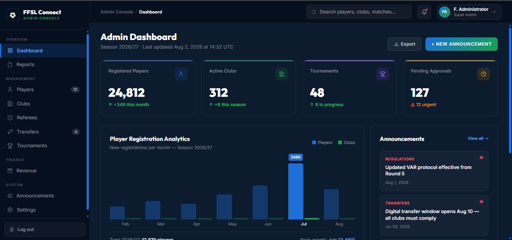
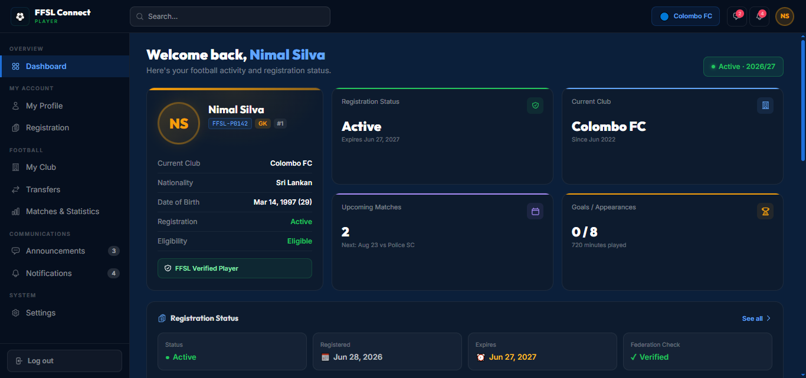
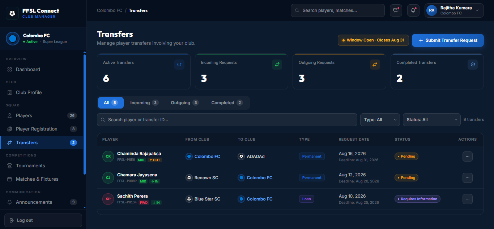
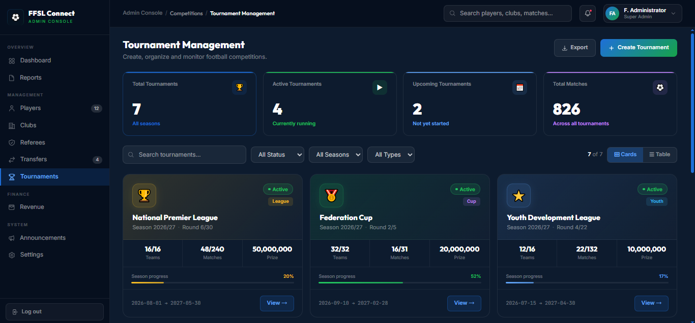

# FFSL Connect - Digital Transformation & E-Business Strategy

Academic project for **IS3207: eBusiness and Digital Marketing**. A digital transformation proposal and interactive prototype for the **Football Federation of Sri Lanka (FFSL)**, the national governing body for football in Sri Lanka.

🔗 **Live prototype:** [ffsl-connect.figma.site](https://ffsl-connect.figma.site/)  
📄 **Full report:** [View Report PDF](./report/Football-Federation-of-SL-Digital-Transformation-Report.pdf)

---

## The Problem

FFSL - Sri Lanka's official football governing body, affiliated with FIFA, the AFC, and SAFF currently operates **without an official website**. Its administration relies on:

- Manual, paper-based processes for player and club registration
- Informal social media (Facebook, Instagram) for communication
- Third-party platforms it doesn't control - FIFA Connect for registration, mytickets.lk for ticketing

This creates recurring problems: lost or misplaced records, difficulty retrieving historical data, loss of institutional knowledge during federation elections (held every 4 years), and limited control over stakeholder data and relationships.

This was validated through a **field visit and stakeholder interview with a senior FFSL official**, which grounded the analysis and prototype in real operational needs rather than assumptions.

---

## Approach

1. **Problem domain analysis** - company profile, current business processes, digital presence audit
2. **Strategic analysis** - SWOT and Porter's Five Forces to assess FFSL's competitive and operational position
3. **Strategy development** - proposed a hybrid e-business model (G2B / B2C / B2B) centered on an FFSL-owned, role-based digital platform
4. **Prototype design** - translated the strategy into a working Figma prototype
5. **Transformation methodology** - a phased roadmap using the **7E Model** (Envision, Engage, Enablement, Execute, Embed, Evaluate) for how FFSL could adopt the platform in practice

---

## The Solution: FFSL Connect

A centralized, role-based web platform designed around four user types:

| Role | Core Workflows |
|---|---|
| **Federation Administrator** | Player approvals, tournament management, transfers oversight, announcements, analytics dashboard |
| **Club Manager** | Player registration, squad/transfer management, club dashboard |
| **Player** | Personal profile, registration status, transfer visibility |
| **Fan** | Match schedules, club/tournament following, news, merchandise & payments |

Key flows demonstrated in the prototype: player registration (multi-step, with document upload), club transfers (request -> review -> confirmation), tournament management and creation, federation announcements, and a fan-facing merchandise store with checkout.

### Screenshots

| Admin Dashboard | Player Registration |
| :---: | :---: |
|  |  |

| Transfer Request | Tournament Management |
| :---: | :---: |
|  |  |

---

## Scope & Limitations

This project covers strategic analysis, prototype design, and transformation methodology only. It does not include actual technical development, deployment, or integration with FIFA Connect or FFSL's existing ticketing/HR systems - those are recommended as future phases in the report's 7E roadmap.

---

## Repo Structure

```text
ffsl-connect-digital-transformation/
├── prototype_screenshots/
│   ├── admin-dashboard.png
│   ├── club-manager-dashboard.png
│   ├── fan-dashboard.png
│   ├── player-dashboard.png
│   ├── player-registeration-1.png
│   ├── player-registeration-2.png
│   ├── player-registeration-3.png
│   ├── player-registeration-4.png
│   ├── player-registeration-5.png
│   ├── player-transfer-flow-1.png
│   ├── player-transfer-flow-2.png
│   ├── player-transfer-flow-3.png
│   ├── player-transfer-flow-4.png
│   ├── tournament-flow-1.png
│   ├── tournament-flow-2.png
│   ├── tournament-flow-3.png
│   └── tournament-flow-4.png
├── report/
│   └── Football-Federation-of-SL-Digital-Transformation-Report.pdf
└── README.md
